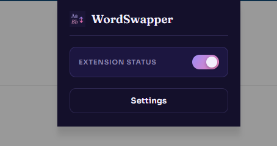
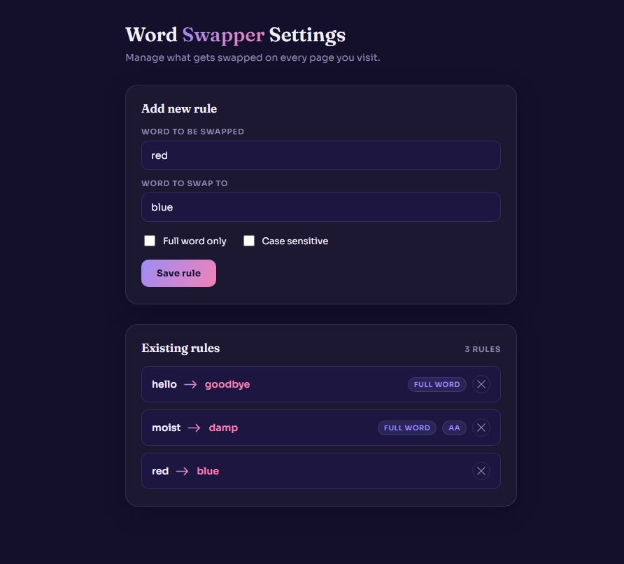

# Word Swapper

A Chrome/Edge extension that automatically swaps specific words for others on every web page you visit.

_not published_

## Table of Contents

- [About](#about)
- [Features](#features)
- [Getting Started](#getting-started)
  - [Prerequisites](#prerequisites)
  - [Installation](#installation)
- [Usage](#usage)
- [Project Structure](#project-structure)
- [Roadmap](#roadmap)

## About

Word Swapper lets you define your own word-replacement rules — pick a word, choose what it should be replaced with, and the extension will swap every matching instance of that word across the pages you browse. Rules can be configured to match whole words only or as substrings, and can be case-sensitive or case-insensitive, giving fine control over exactly what gets swapped.

Built as a personal project to learn Chrome extension development: manifest configuration, `chrome.storage`, content scripts, and DOM traversal.





## Features

- **Custom word rules** — define any number of find/replace word pairs
- **Whole word or substring matching** — toggle per rule whether matches must be a full word or can appear inside other words
- **Case sensitivity control** — toggle per rule whether matching respects letter casing
- **Runs on every page** — rules are applied automatically as you browse, no per-site setup needed
- **Enable/disable toggle** — quickly turn the extension on or off from the popup without uninstalling
- **Persistent storage** — rules are saved via `chrome.storage.sync` and stick around across browser sessions

## Getting Started

### Prerequisites

- Google Chrome or Microsoft Edge (any recent version supporting Manifest V3)
- No build step, external services, or API keys required

### Installation

Since this extension isn't published to the Chrome Web Store, it's loaded locally in developer mode:

1. Clone the repository `git clone https://github.com/IcedPeppermintTea/word-swapper-extension.git`
2. Open your browser's extensions page
3. Chrome: chrome://extensions
4. Edge: edge://extensions
5. Enable Developer mode (toggle, usually in the top-right)
6. Click Load unpacked and select the cloned word-swapper-extension folder
7. Pin the extension to your toolbar

## Usage

1. Click the Word Swapper icon in your toolbar to open the popup
2. Click **Settings** to open the full rules page
3. Enter a word to swap and the word to swap it to
4. Optionally check **Full word only** and/or **Case sensitive** to control how strictly the rule matches
5. Click **Save rule**
6. Refresh any open tabs (or use the extension toggle, which reloads the active tab automatically) to see your rules applied

Use the toggle switch in the popup to turn all swapping on or off at any time without losing your saved rules.

## Project Structure

```
.
├── assets/             # Icons and static assets
├── js/
│   ├── index.js        # Popup logic (settings link, enable/disable toggle)
│   ├── settings.js      # Settings page logic (add/delete rules, storage read/write)
│   └── content-script.js # Injected into every page; applies rules to page text
├── index.html           # Toolbar popup UI
├── settings.html         # Full settings/rules management page
├── manifest.json         # Extension configuration (Manifest V3)
└── README.md
```

## Roadmap

- [ ] `MutationObserver` support for dynamically-loaded content (ex: infinite scroll, single-page apps)
- [ ] Make live rule updates in already-open tabs via `chrome.storage.onChanged`
- [ ] Per-site enable/disable rules
- [x] Whole word / substring matching toggle
- [x] Case-sensitive matching toggle
- [x] Enable/disable extension toggle
- [x] Display error message if user hits save with empty word field
- [ ] Move functions to their own separate page / ES module
